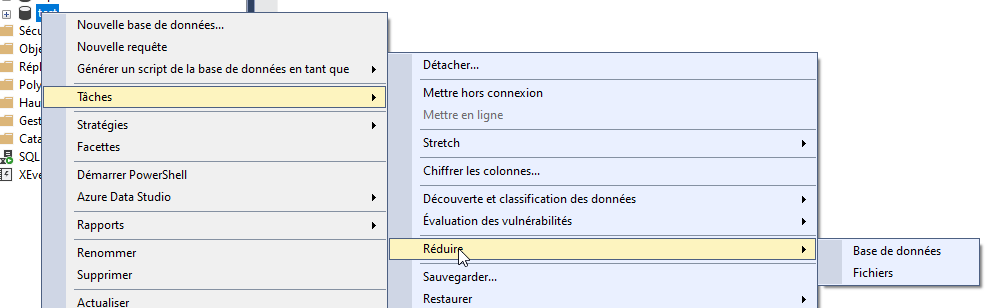
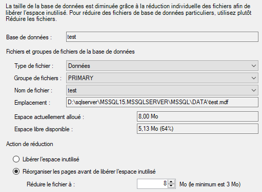
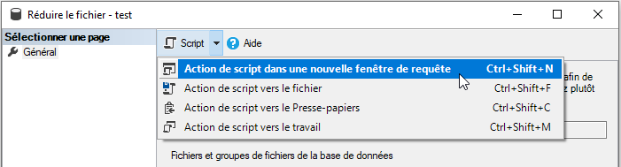

# Shrink d'un fichier de bases de données

La diminution de taille des fichier physiques de votre base de données est déconseillée.
C'est une opération coûteuse et souvent inutile.

Cette opération s'appelle un [SHRINK](https://docs.microsoft.com/fr-fr/sql/relational-databases/databases/shrink-a-database).

Ne prévoyez cette opération qu'en cas de dépassement important de la taille du fichier, qui vous force à récupérer de l'espace libre sur le disque de votre serveur.

Ne planifiez jamais un `SHRINK` dans un plan de maintenance. Vous pouvez regarder cette vidéo sur le sujet : [https://youtu.be/Bl0p6GREFg8](https://youtu.be/Bl0p6GREFg8).

Un SHRINK reste une opération manuelle, administrative, ponctuelle, quand vous en avez vraiment besoin.

Les bases de données ont une propriété «&nbsp;réduction automatique&nbsp;» (*auto shrink*). [N'activez JAMAIS cette option](https://docs.microsoft.com/en-us/troubleshoot/sql/admin/considerations-autogrow-autoshrink).

## Pourquoi éviter les `SHRINK` ?

Le shrink sur un fichier de données est une opération lourde et **fragmente fortement les tables et les index**. Explication détaillée de [Paul Randal](https://www.sqlskills.com/about/paul-s-randal/), qui a développé la commande de `SHRINK` en SQL Server 2005 : [Why you should not shrink your data files](https://www.sqlskills.com/blogs/paul/why-you-should-not-shrink-your-data-files/).

## Commandes T-SQL

Les commandes Transact-SQL pour effectuer un SHRINK sont :

- `DBCC SHRINKDATABASE` &mdash; pour réduire la taille de tous les fichiers de la base de données : fichier de données et fichiers de journaux de transaction. **N'utilisez pas cette commande**, soyez plus spécifique.
- [`DBCC SHRINKFILE`](https://docs.microsoft.com/fr-fr/sql/t-sql/database-console-commands/dbcc-shrinkfile-transact-sql) &mdash; pour réduire la taille d'un fichier spécifique. C'est la commande à privilégier.

## Comment réduire un fichier

1. Sélectionnez le fichier à réduire, et décidez d'une taille cible. **Ne réduisez pas le fichier au maximum**, vous voulez conserver de l'espace libre dans le fichier pour le futur. Vous pouvez utiliser la fenêtre de SSMS pour vous faciliter la tâche, et générez le script ensuite. Vous voulez générer le script plutôt que laisser la fenêtre de SSMS exécuter la commande, vous pourrez ainsi mieux maîtriser l'opération, voir les messages dans la fenêtre de résultat de SSMS, et relancer la commande au besoin.

    Interface graphique pour réduire un fichier.
    
    
    
    Sélectionnez l'option qui permet de définir une taille cible.

    
    
    Exportez le script dans une nouvelle fenêtre.

    
    
    Le script exporté va ressembler à ceci.
    
    ```sql
    USE [test]
    GO
    DBCC SHRINKFILE (N'test' , 8)
    GO
    ```

    Le premier paramètre de la commande est le *nom logique* du fichier, le deuxième paramètre est la taille cible en Mo.

    ### Comment trouver un nom logique ?

    Vous pouvez utiliser le code suivant :

    ```sql
    SELECT 
        file_id,
        CASE type_desc 
            WHEN 'ROWS' THEN 'DONNEES'
            WHEN 'LOG' THEN 'JOURNAL'
            ELSE type_desc
        END as [type],
        name as [nom logique],
        physical_name as [nom physique]
    FROM sys.database_files;
    ```

2. Exécutez la commande.

    La commande est non bloquante. Selon la taille du fichier, elle peut durer longtemps, ce n'est pas très grave.

### Comment surveiller l'opération ?

L'exécution de la commande peut être suivie par une requête sur `sys.dm_exec_requests`. Des exemples complets de requêtes sur cette vue peuvent être trouvés ici : [https://github.com/rudi-bruchez/tsql-scripts/tree/master/diagnostics/execution](https://github.com/rudi-bruchez/tsql-scripts/tree/master/diagnostics/execution).

Voici une requête qui vous montre l'opération en cours (à exécuter donc dans une autre fenêtre de SSMS).

```sql
SELECT 
    session_id,
    start_time,
    status,
    DB_NAME(database_id) as [db],
    blocking_session_id,
    wait_time,
    wait_type,
    wait_resource,
    percent_complete,
    total_elapsed_time
FROM sys.dm_exec_requests WITH (READUNCOMMITTED)
WHERE command IN (N'DbccFilesCompact', N'DbccSpaceReclaim')
OPTION (RECOMPILE, MAXDOP 1);
```

La colonne `percent_complete` vous indique un pourcentage estimé de l'achèvement de la commande.

> Vous pouvez aussi utiliser l'excellente procédure [whoisactive](http://whoisactive.com/). Elle contient la colonne `percent_complete`.

#### comprendre le statut

La commande en cours peut être en `RUNNING` ou en `SUSPENDED`. bien souvent elle sera en `SUSPENDED`, car elle attend sur le système pour continuer son travail.

Vous trouvez la raison de l'attente dans la colonne `wait_type`, et la durée de l'attente actuelle dans la colonne `wait_time`. La valeur de `wait_time` est en millisecondes.

Les cas classiques de `wait_type` :

* [`PAGEIOLATCH_EX`](https://www.sqlskills.com/help/waits/pageiolatch_ex/) &mdash; La commande DBCC est en train d'attendre sur la lecture de pages de données sur le disque. Si le disque est lent ou saturé, cela ralentira l'opération et vous verrez des attentes importantes de ce type.

<p align="right">
<i><small>[<a href="https://www.pachadata.com/contact/">Besoin de services avec SQL Server ? Contactez-moi</a>]</small></i>
</p>
