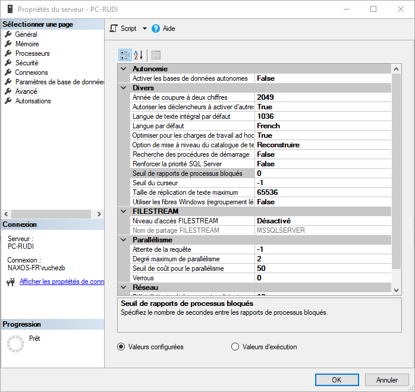

# Comment identifier les problèmes de blocages

Les blocages proviennent de verrous maintenus sur les mêmes ressources par des dessions différentes.

Vous pouvez identifier les verrous en cours à un instant T à l'aide de la requête suivante : [analyze-blocked-sessions.sql](https://github.com/rudi-bruchez/tsql-scripts/blob/ac246e8d9504308848cdc893d42dbc9c9bdb051a/diagnostics/locking/analyze-blocked-sessions.sql).

Si vous voyez des attentes sur des `wait_type` qui commencent par `LCK`, il s'agit de blocages. Regardez la valeur de `wait_duration_sec` pour savoir depuis combien de secondes cette session attend.

## Mode de verrouillage

Le mode de verrouillage donne plus d'indication sur le verrou qui est en attente.

| mode | explication |
| ---- | ----------- |
| LCK_M_IX | on essaie d'acquérir un verrous d'intention d'écriture. |

## Tracer les cas de blocages

Pour tracer les cas de blocage et remonter plus facilement à la source, utilisez une session d'évènements étendus.

D'abord, définissez sur votre instance le seuil de processus bloqués. Après combien de secondes voulez-vous qu'un évènement soit déclenché ? Vous le définissez à l'aide de la commande suivante :

```sql
EXEC sys.sp_configure N'show advanced options', N'1'  
RECONFIGURE WITH OVERRIDE
GO
EXEC sys.sp_configure N'blocked process threshold (s)', N'10'
RECONFIGURE WITH OVERRIDE
GO
EXEC sys.sp_configure N'show advanced options', N'0'  
RECONFIGURE WITH OVERRIDE
GO
```

Ici, nous demandons une génération d'évènements après dix secondes de blocage.

Vous pouvez aussi le configurer dans SSMS dans les propriétés de l'instance, comme illustré dans la copie d'écran ci-dessous.



### démarrage de la session d'évènements

Créez ensuite la session d'évènements à l'aide de la commande que vous trouvez [à cette adresse](https://github.com/rudi-bruchez/tsql-scripts/blob/ac246e8d9504308848cdc893d42dbc9c9bdb051a/extended-events/on-prem/blocked-process-report.sql).

N'exécutez que la première partie de la requête, celle qui contient la commande `CREATE EVENT SESSION`.

Ensuite, démarrez la session à l'aide de la commande suivante que vous trouvez aussi dans le code source :

```sql
ALTER EVENT SESSION [blocked_processes] ON SERVER STATE=START;
```

<p align="right">
<i><small>[<a href="https://www.pachadata.com/contact/">Besoin de services avec SQL Server ? Contactez-moi</a>]</small></i>
</p>
